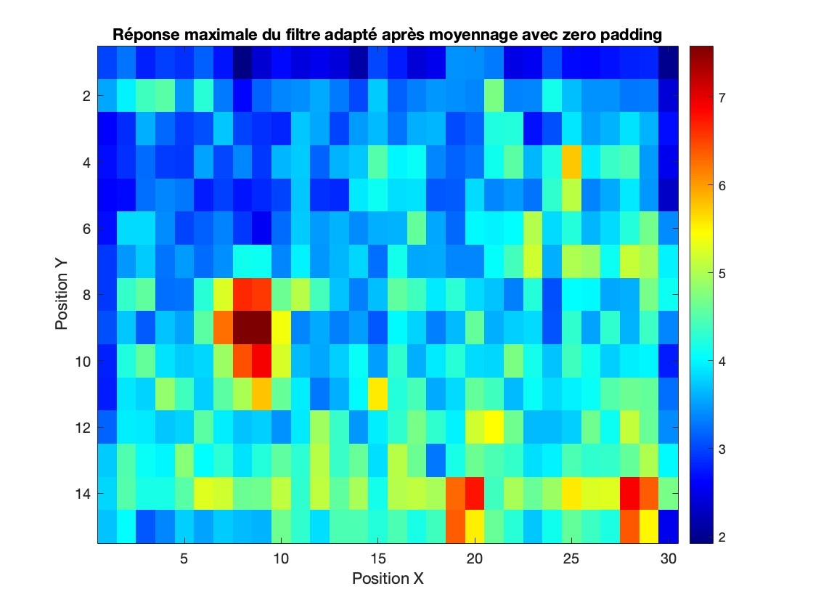
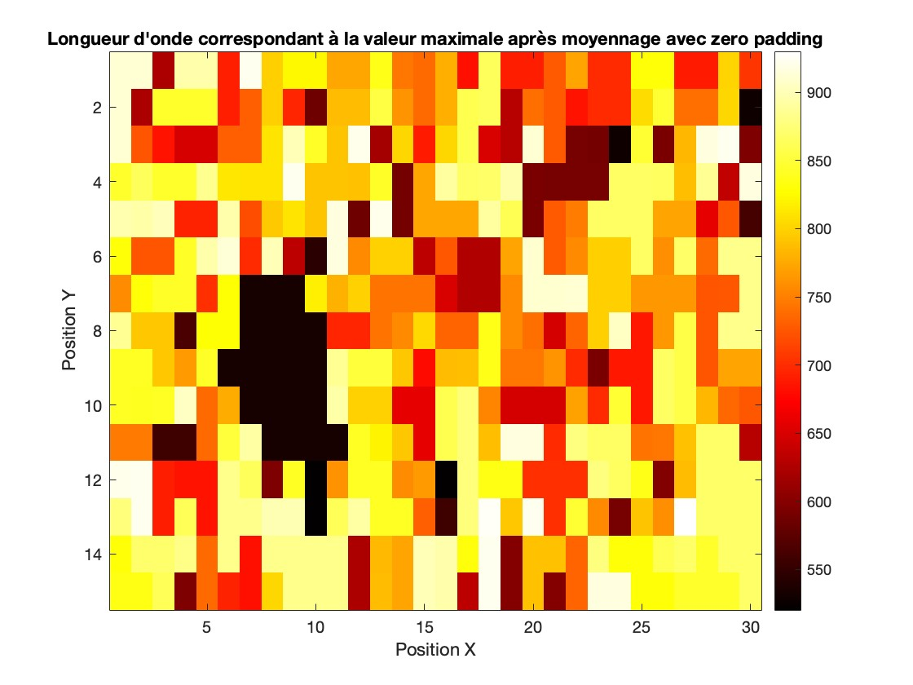

# HDFS MUSE Distant Galaxy Detection in MATLAB

This repository contains MATLAB scripts tailored for the analysis of astronomical data from the HDFS MUSE (High Deep Field South Multi-Unit Spectroscopic Explorer) dataset. The primary goal of these scripts is to facilitate the detection and analysis of very distant galaxies through advanced spectral analysis techniques.

## Project Overview

The universe is filled with galaxies at various distances from us. Detecting and studying very distant galaxies is crucial for understanding the early universe, including galaxy formation and evolution. This project employs MATLAB scripts to analyze spectral data from the HDFS MUSE dataset, which is renowned for its depth and quality, making it ideal for studying distant cosmic objects.

## Gallery

Here are some visualizations from our analysis:

*Galaxy detection using MUSE dataset.*

*Corresponding wavelenght*

## Features

- **Lyman-alpha (Lyα) Emission Line Analysis**: The Lyα line is a key spectral feature used to identify distant galaxies. The scripts plot and analyze this emission line.
- **Spectral Analysis at Pixel Level**: Detailed examination of spectra from specific pixels in the data cube, providing insights into the characteristics of different regions in the field of view.
- **Autocorrelation and Intercorrelation**: These statistical tools are used to uncover hidden patterns in the spectral data, which are essential for identifying distant galaxies.
- **Matched Filtering for Feature Detection**: A matched filter adapted to the Lyα line is applied to efficiently detect distant galaxies that exhibit this spectral feature.
- **Zero Padding for Edge Analysis**: Enhances the effectiveness of mean filtering on data at the edges of the cube, ensuring comprehensive analysis across the entire field.
- **Signal-to-Noise Ratio (SNR) Improvements**: Evaluation of SNR improvements, crucial for distinguishing faint signals from distant galaxies amidst noise.
- **Automated Feature Detection Across Data Cube**: Systematic scanning of the cube to detect spectral features indicative of distant galaxies.

## Getting Started

### Dependencies

- MATLAB (recommended version: R20XX or later)
- Signal Processing Toolbox for MATLAB

### Installation and Execution

- Clone this repository using `git clone`.
- Load your HDFS MUSE data in MATLAB format.
- Execute the scripts in MATLAB to perform the analysis and view the results.

## Contributing

Contributions, especially those that enhance the detection and analysis of distant galaxies, are welcome. Please fork the repository and submit pull requests for review.

## Acknowledgments

- Gratitude to the teams and organizations behind the HDFS MUSE dataset.

## License

This project is licensed under the [MIT License](LICENSE) - see the LICENSE file for details.
